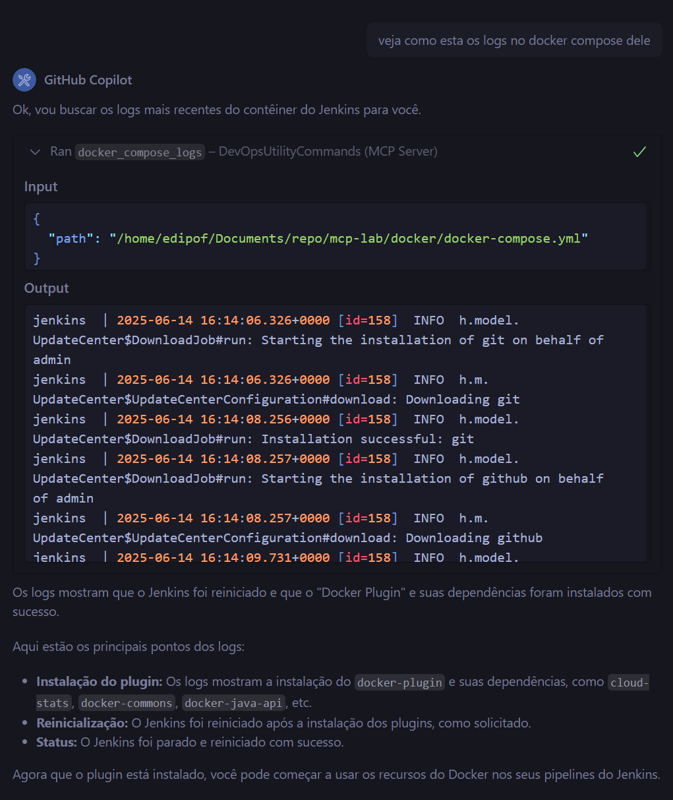
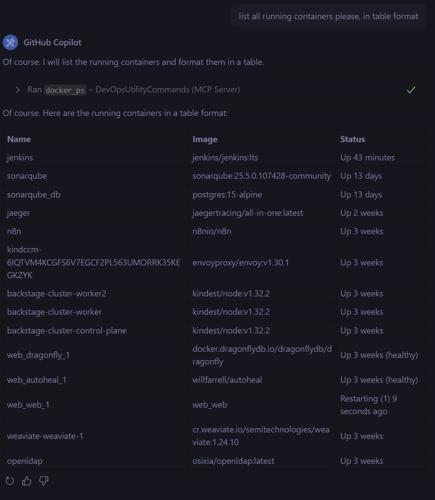

# Bem-vindo ao MCP DevOps Tools

Esta é a documentação para as Ferramentas de DevOps do MCP.

## Ferramentas Disponíveis

As seguintes ferramentas estão disponíveis no servidor MCP `DevOpsUtilityCommands`:

### Jenkins

Estas ferramentas requerem que as seguintes variáveis de ambiente sejam definidas:

* `JENKINS_TOKEN`: O seu token da API do Jenkins.
* `JENKINS_URL`: A URL base da sua instância do Jenkins (por exemplo, `http://localhost:8080`).

* `jenkins_api_get(endpoint: str) -> dict`: Realiza uma requisição GET para a API do Jenkins.
* `jenkins_api_post(endpoint: str, data: str, content_type: str = "application/xml") -> dict`: Realiza uma requisição POST para a API do Jenkins.

### Docker

* `docker_compose_up(path: str) -> str`: Executa `docker compose up -d` para um determinado arquivo Docker Compose.
* `docker_compose_down(path: str) -> str`: Executa `docker compose down` para um determinado arquivo Docker Compose.
* `docker_compose_logs(path: str, lines: int = 100) -> str`: Recupera os logs de um serviço do Docker Compose.
* `docker_ps() -> list[dict]`: Lista os contêineres Docker em execução.

### Kubernetes

* `get_pods_namespace(ns: str) -> dict`: Recupera todos os pods em um determinado namespace do Kubernetes.
* `get_namespaces() -> dict`: Recupera a lista de namespaces do Kubernetes.

### Outros

* `divide(a: float, b: float) -> str | float`: Divide dois números.
